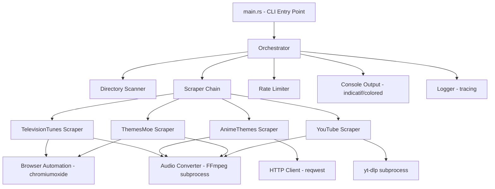

# Design Document: Rust Rewrite

## Overview

This design describes the architecture for rewriting Show Theme CLI from Python to Rust (2024 edition). The rewrite preserves the existing waterfall scraper architecture while leveraging Rust's type system, async runtime, and single-binary distribution. The core design maps closely to the Python original: a CLI layer parses arguments, an orchestrator coordinates scraper execution, and individual scraper modules implement source-specific logic behind a common trait.

Key Rust crates:

- **clap** (derive): CLI argument parsing (replaces Typer)
- **reqwest**: HTTP client (replaces httpx)
- **chromiumoxide**: Headless Chrome automation (replaces Playwright)
- **tokio**: Async runtime for browser automation and HTTP
- **indicatif**: Progress bars and spinners (replaces Rich progress)
- **console + colored**: Colored terminal output (replaces Rich console)
- **yt-dlp**: Called as subprocess (same as Python)
- **FFmpeg**: Called as subprocess (same as Python)
- **proptest**: Property-based testing (replaces Hypothesis)
- **tracing + tracing-subscriber**: Structured logging (replaces Python logging)
- **strsim**: String similarity (replaces difflib.SequenceMatcher)

## Architecture



The architecture follows the same layered pattern as the Python version:

1. **CLI Layer** (`main.rs`): Parses arguments via clap derive macros, sets up logging, validates dependencies, and invokes the orchestrator.
2. **Orchestration Layer** (`orchestrator.rs`): Scans directories, checks for existing themes, iterates scrapers in priority order, aggregates results, displays summary.
3. **Scraper Layer** (`scrapers/`): Each scraper implements the `ThemeScraper` trait. Browser-based scrapers use chromiumoxide; API-based scrapers use reqwest.
4. **Utility Layer** (`utils.rs`, `ffmpeg.rs`, `rate_limiter.rs`): Shared functionality for file validation, audio conversion, rate limiting, and input sanitization.

The async runtime (tokio) is used at the top level. Browser automation and HTTP requests are naturally async. The orchestrator processes shows sequentially (same as Python) to keep console output orderly and avoid overwhelming sources.

## Components and Interfaces

### Scraper Trait

```rust
use std::path::Path;
use async_trait::async_trait;

#[async_trait]
pub trait ThemeScraper: Send + Sync {
    /// Search for and download a theme song.
    /// Returns Ok(true) on success, Ok(false) if not found, Err on fatal error.
    async fn search_and_download(
        &self,
        show_name: &str,
        output_path: &Path,
    ) -> anyhow::Result<bool>;

    /// Human-readable source name.
    fn source_name(&self) -> &str;
}
```

### CLI Arguments (clap derive)

```rust
use clap::Parser;
use std::path::PathBuf;

#[derive(Parser, Debug)]
#[command(name = "show-theme-cli", version, about = "Automate theme song downloads for TV shows and anime")]
pub struct CliArgs {
    /// Root directory containing show folders
    pub input_dir: Option<PathBuf>,

    /// Overwrite existing theme files
    #[arg(short, long)]
    pub force: bool,

    /// Enable debug logging
    #[arg(short, long)]
    pub verbose: bool,

    /// Simulate operations without downloading
    #[arg(long)]
    pub dry_run: bool,

    /// Network timeout in seconds
    #[arg(short, long, default_value_t = 30)]
    pub timeout: u64,

    /// Show version and exit
    #[arg(long)]
    pub version_flag: bool,
}
```

### Orchestrator

```rust
pub struct Orchestrator {
    scrapers: Vec<Box<dyn ThemeScraper>>,
    rate_limiter: RateLimiter,
    config: OrchestratorConfig,
    results: ProcessingResults,
}

pub struct OrchestratorConfig {
    pub force: bool,
    pub dry_run: bool,
    pub verbose: bool,
    pub timeout: u64,
}

pub struct ProcessingResults {
    pub success: u32,
    pub skipped: u32,
    pub failed: u32,
}
```

### Rate Limiter

```rust
use std::collections::HashMap;
use std::time::Instant;

pub struct RateLimiter {
    last_attempt: HashMap<String, Instant>,
    min_delay_ms: u64,
    max_delay_ms: u64,
}
```

### FFmpeg / Audio Converter

```rust
pub enum FfmpegErrorType {
    MissingCodec,
    CorruptedInput,
    DiskSpace,
    PermissionDenied,
    Timeout,
    InvalidFormat,
    Unknown,
}

pub struct FfmpegError {
    pub error_type: FfmpegErrorType,
    pub message: String,
    pub stderr: String,
}

/// Convert audio/video to MP3 using FFmpeg subprocess.
pub async fn convert_audio(
    input: &Path,
    output: &Path,
    bitrate: &str,
) -> Result<(), FfmpegError>;

/// Get audio duration via ffprobe.
pub fn get_audio_duration(path: &Path) -> Option<String>;
```

### File Validator

```rust
pub const MIN_FILE_SIZE_BYTES: u64 = 500_000;

pub fn validate_file_size(path: &Path, min_size: u64) -> bool;
pub fn get_file_size_formatted(path: &Path) -> String;
```

### Input Sanitization

```rust
pub fn sanitize_for_subprocess(value: &str, max_length: usize) -> Result<String, String>;
pub fn validate_show_name(name: &str) -> bool;
pub fn sanitize_filename(filename: &str) -> String;
```

### Config Constants

```rust
pub struct Config;

impl Config {
    pub const MIN_FILE_SIZE_BYTES: u64 = 500_000;
    pub const DEFAULT_TIMEOUT_SEC: u64 = 30;
    pub const DOWNLOAD_TIMEOUT_SEC: u64 = 60;
    pub const AUDIO_BITRATE: &'static str = "320k";
    pub const AUDIO_CODEC: &'static str = "libmp3lame";
    pub const MAX_VIDEO_DURATION_SEC: u64 = 600;
    pub const RATE_LIMIT_MIN_DELAY_MS: u64 = 1000;
    pub const RATE_LIMIT_MAX_DELAY_MS: u64 = 3000;
    pub const MAX_RETRY_ATTEMPTS: u32 = 3;
    pub const RETRY_BACKOFF_FACTOR: f64 = 2.0;
    pub const FFMPEG_TIMEOUT_SEC: u64 = 60;
    pub const THEME_EXTENSIONS: &'static [&'static str] = &[".mp3", ".flac", ".wav"];
}
```

## Data Models

### Show Processing

```rust
pub struct ShowFolder {
    pub path: PathBuf,
    pub name: String,
    pub search_name: String,  // name with year stripped
}

pub enum ShowResult {
    Success { source: String, file_size: String, duration: String },
    Skipped { reason: String },
    Failed { attempted_sources: Vec<String> },
    DryRun,
}
```

### Scraper Results

```rust
pub enum ScraperOutcome {
    Downloaded,
    NotFound,
    Error(anyhow::Error),
}
```

### FFmpeg Error Categorization

The `FfmpegErrorType` enum and `FfmpegError` struct (shown above) categorize FFmpeg failures by parsing stderr patterns, identical to the Python implementation.

### Retry Logic

Retry with exponential backoff is implemented as a generic async utility function:

```rust
pub async fn retry_with_backoff<F, Fut, T, E>(
    max_attempts: u32,
    backoff_factor: f64,
    mut operation: F,
) -> Result<T, E>
where
    F: FnMut() -> Fut,
    Fut: std::future::Future<Output = Result<T, E>>,
    E: std::fmt::Display,
{
    // retry loop with tokio::time::sleep between attempts
}
```

## Rust Project Structure

```
show-theme-cli/
├── Cargo.toml              # Rust 2024 edition, all dependencies
├── src/
│   ├── main.rs             # CLI entry point, clap parsing, logging setup
│   ├── config.rs           # Config constants
│   ├── orchestrator.rs     # Orchestrator struct and processing logic
│   ├── utils.rs            # File validation, sanitization, path helpers
│   ├── ffmpeg.rs           # FFmpeg subprocess wrapper, error parsing
│   ├── rate_limiter.rs     # Rate limiter with jitter
│   ├── retry.rs            # Generic retry with exponential backoff
│   └── scrapers/
│       ├── mod.rs           # ThemeScraper trait definition, re-exports
│       ├── tv_tunes.rs      # TelevisionTunes scraper (chromiumoxide)
│       ├── anime_themes.rs  # AnimeThemes API scraper (reqwest)
│       ├── themes_moe.rs    # Themes.moe scraper (chromiumoxide)
│       └── youtube.rs       # YouTube scraper (yt-dlp subprocess)
├── tests/
│   ├── unit/               # Unit tests
│   ├── properties/         # Property-based tests (proptest)
│   └── integration/        # Integration tests with mocked scrapers
└── .kiro/
    ├── hooks/              # Updated for Rust (clippy, cargo fmt)
    └── steering/           # Updated for Rust project structure
```

## Correctness Properties

_A property is a characteristic or behavior that should hold true across all valid executions of a system — essentially, a formal statement about what the system should do. Properties serve as the bridge between human-readable specifications and machine-verifiable correctness guarantees._

### Property 1: Invalid path rejection

_For any_ path string that does not correspond to an existing directory on the filesystem, the CLI path validation SHALL return an error.

**Validates: Requirements 1.8**

### Property 2: Directory scanning completeness

_For any_ directory containing N immediate subdirectories, the directory scanner SHALL return exactly N `ShowFolder` entries, one per subdirectory.

**Validates: Requirements 2.1**

### Property 3: Year stripping preserves base name

_For any_ string of the form `"{name} ({four_digits})"`, stripping the year portion SHALL produce `"{name}"` (trimmed). For any string without a year pattern, stripping SHALL return the original string unchanged.

**Validates: Requirements 2.2**

### Property 4: Existing theme detection and skip behavior

_For any_ folder containing a file with extension `.mp3`, `.flac`, or `.wav` named `theme.*`, when force is false, the orchestrator SHALL produce a `Skipped` result for that folder.

**Validates: Requirements 3.1, 3.2**

### Property 5: Force mode deletes existing theme

_For any_ folder containing an existing theme file, when force is true, the orchestrator SHALL delete the existing file before proceeding with download.

**Validates: Requirements 3.3**

### Property 6: Scraper chain short-circuits on success

_For any_ ordered list of N mock scrapers where the K-th scraper (1-indexed) succeeds and all prior scrapers fail, exactly K scrapers SHALL be invoked.

**Validates: Requirements 4.2, 4.3**

### Property 7: Error isolation across shows

_For any_ sequence of shows where processing one show raises an error, all subsequent shows in the sequence SHALL still be processed.

**Validates: Requirements 4.5, 12.1**

### Property 8: Best match selection by string similarity

_For any_ list of anime names and a query string, the selected best match SHALL have the highest string similarity score compared to the query. If multiple names tie, any of the tied names is acceptable.

**Validates: Requirements 6.2**

### Property 9: Theme type priority selection

_For any_ list of anime themes containing a mix of OP1, other OP, and non-OP themes, the selector SHALL return OP1 if present, otherwise any OP if present, otherwise the first theme.

**Validates: Requirements 6.3**

### Property 10: YouTube search query generation

_For any_ non-empty show name, the generated YouTube search queries SHALL contain at least the variation `"{show_name} theme song"` and SHALL all contain the show name as a substring.

**Validates: Requirements 8.1**

### Property 11: YouTube duration filtering

_For any_ video duration value, the duration check SHALL accept durations ≤ 600 seconds and reject durations > 600 seconds.

**Validates: Requirements 8.2**

### Property 12: FFmpeg command construction

_For any_ valid input path and output path, the constructed FFmpeg command SHALL include `-acodec libmp3lame`, `-b:a 320k`, and `-vn` flags.

**Validates: Requirements 9.1**

### Property 13: FFmpeg error categorization

_For any_ stderr string containing a known error pattern (e.g., "Unknown encoder", "No space left on device", "Permission denied"), the error parser SHALL categorize it into the correct `FfmpegErrorType` variant.

**Validates: Requirements 9.2**

### Property 14: File size validation

_For any_ file size value, `validate_file_size` SHALL return true if and only if the size exceeds 500,000 bytes.

**Validates: Requirements 9.3, 9.4**

### Property 15: Rate limiter delay bounds

_For any_ sequence of two consecutive calls to the rate limiter for the same source, the elapsed time between the calls SHALL be at least 1.0 seconds.

**Validates: Requirements 11.1, 11.3**

### Property 16: Retry with exponential backoff

_For any_ operation that fails K times (K < 3) then succeeds, the retry mechanism SHALL make exactly K+1 total attempts. If the operation fails all 3 times, the mechanism SHALL return a failure result after exactly 3 attempts.

**Validates: Requirements 13.1, 13.2, 13.3**

### Property 17: Input sanitization removes dangerous characters

_For any_ string containing shell metacharacters (`;`, `|`, `&`, `` ` ``, `<`, `>`) or control characters or path traversal sequences (`..`), the sanitization function SHALL produce a string that contains none of those characters or sequences.

**Validates: Requirements 16.1, 16.3**

### Property 18: Show name length validation

_For any_ string longer than 200 characters, `validate_show_name` SHALL return false. For any non-empty string of 200 characters or fewer (without excessive special characters), it SHALL return true.

**Validates: Requirements 16.2**

## Error Handling

### Error Strategy

The Rust rewrite uses `anyhow::Result` for error propagation at the application level and `thiserror` for defining domain-specific error types.

**Error Hierarchy:**

```rust
#[derive(thiserror::Error, Debug)]
pub enum AppError {
    #[error("Critical error: {0}")]
    Critical(String),

    #[error("Scraper error in {source}: {message}")]
    Scraper { source: String, message: String },

    #[error("FFmpeg error: {0}")]
    Ffmpeg(#[from] FfmpegError),

    #[error("IO error: {0}")]
    Io(#[from] std::io::Error),

    #[error("Network error: {0}")]
    Network(#[from] reqwest::Error),
}
```

**Error Isolation Pattern:**

- Each show is processed in a `catch_unwind` + `Result` boundary
- Scraper errors are caught per-scraper and logged, then the chain continues
- Only `AppError::Critical` (e.g., input directory doesn't exist) stops the entire run
- All other errors are logged and counted in `ProcessingResults`

**FFmpeg Error Parsing:**

- Stderr is parsed line-by-line against regex patterns
- Errors are categorized into `FfmpegErrorType` variants
- Transient errors (timeout, unknown) are eligible for retry

### Cleanup Guarantees

- Temporary files are cleaned up using `Drop` implementations or explicit `finally`-style blocks via `scopeguard`
- Browser instances are closed in `Drop` implementations on the scraper structs
- Partial downloads are deleted on failure

## Testing Strategy

### Testing Framework

- **Unit tests**: `#[cfg(test)]` modules within each source file, plus `tests/unit/`
- **Property tests**: `proptest` crate in `tests/properties/`
- **Integration tests**: `tests/integration/` with mock scrapers

### Property-Based Testing (proptest)

Each correctness property maps to a proptest test. Configuration:

- Minimum 100 cases per property (`PROPTEST_CASES=100`)
- Each test is tagged with a comment referencing the design property:
  ```rust
  // Feature: rust-rewrite, Property 1: Invalid path rejection
  ```

### Unit Testing

Unit tests cover:

- Specific examples for CLI argument parsing
- Edge cases: empty directories, permission errors, empty show names
- FFmpeg error parsing with known stderr samples
- Config constant values

### Integration Testing

Integration tests use mock scraper implementations:

- Mock scrapers that return success/failure on demand
- Temp directories with controlled folder structures
- Verify orchestrator behavior end-to-end without network calls

### Test Commands

```bash
# Run all tests
cargo test

# Run only property tests
cargo test --test properties

# Run only unit tests
cargo test --lib

# Run with output
cargo test -- --nocapture

# Run clippy
cargo clippy -- -D warnings

# Format check
cargo fmt -- --check
```
