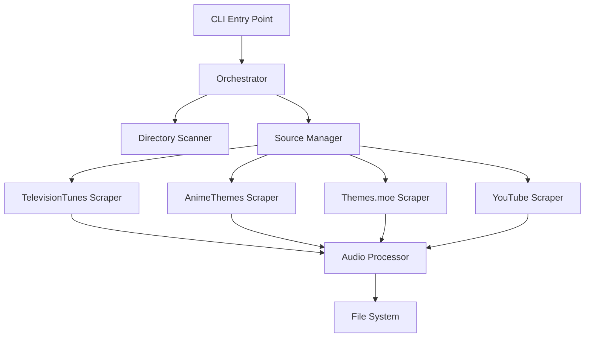

# Design Document: Show Theme CLI

## Overview

The Show Theme CLI is a Python-based command-line application that automates theme song retrieval for TV shows and anime series. The system follows a modular architecture with a clear separation between the CLI interface, orchestration logic, and source-specific scrapers.

The application uses a waterfall approach, attempting sources in priority order (TelevisionTunes → AnimeThemes → Themes.moe → YouTube) until a theme is successfully downloaded. Each source is implemented as an independent scraper following a common interface, making the system extensible and maintainable.

Key design principles:
- **Modularity**: Each source is an independent, swappable component
- **Fail-fast with fallback**: Move to next source immediately on failure
- **Idempotency**: Safe to re-run without re-downloading existing themes
- **User feedback**: Rich console output with clear status indicators

## Architecture

### High-Level Architecture



### Component Responsibilities

**CLI Layer (main.py)**
- Parse command-line arguments using Typer
- Validate input directory
- Initialize Rich console for output
- Invoke orchestrator with configuration

**Orchestration Layer (core/orchestrator.py)**
- Iterate through series folders
- Check for existing theme files
- Coordinate scraper attempts in priority order
- Aggregate and display results

**Scraper Layer (scrapers/)**
- Implement source-specific search and download logic
- Follow common ThemeScraper interface
- Handle source-specific errors gracefully
- Return success/failure status

**Utility Layer (core/utils.py)**
- File system operations (path validation, sanitization)
- String similarity matching for search results
- Audio processing coordination (FFmpeg wrapper)

### Technology Stack Rationale

**Typer**: Modern CLI framework with excellent type hints and automatic help generation. Provides clean argument parsing and validation.

**Rich**: Provides beautiful console output with progress bars, tables, and colored status messages. Essential for user feedback during long-running operations.

**Playwright**: Robust web automation framework with excellent JavaScript rendering support. Required for sites like TelevisionTunes and Themes.moe that don't offer APIs.

**httpx**: Modern async-capable HTTP client with excellent performance. Used for AnimeThemes.moe API calls.

**yt-dlp**: Industry-standard YouTube downloader with extensive format support and active maintenance. Handles YouTube fallback reliably.

**FFmpeg**: Universal media processing tool. Required for extracting audio from video files (especially for AnimeThemes.moe).

## Components and Interfaces

### Base Scraper Interface

```python
from abc import ABC, abstractmethod
from pathlib import Path
from typing import Optional

class ThemeScraper(ABC):
    """Abstract base class for all theme scrapers."""
    
    @abstractmethod
    def search_and_download(self, show_name: str, output_path: Path) -> bool:
        """
        Search for and download a theme song.
        
        Args:
            show_name: Name of the TV show or anime
            output_path: Full path where theme file should be saved
            
        Returns:
            True if download succeeded, False otherwise
        """
        pass
    
    @abstractmethod
    def get_source_name(self) -> str:
        """Return human-readable name of this source."""
        pass
```

### TelevisionTunes Scraper

```python
from playwright.sync_api import sync_playwright, Page, TimeoutError
from pathlib import Path
import time
import random

class TelevisionTunesScraper(ThemeScraper):
    BASE_URL = "https://www.televisiontunes.com/"
    TIMEOUT = 30000  # 30 seconds
    
    def search_and_download(self, show_name: str, output_path: Path) -> bool:
        with sync_playwright() as p:
            browser = p.chromium.launch(headless=True)
            page = browser.new_page()
            
            try:
                # Navigate to homepage
                page.goto(self.BASE_URL, timeout=self.TIMEOUT)
                
                # Locate and fill search field
                search_input = page.locator("#search_field")
                search_input.fill(show_name)
                search_input.press("Enter")
                
                # Wait for results
                page.wait_for_load_state("networkidle")
                
                # Find first result or exact match
                result = self._find_best_match(page, show_name)
                if not result:
                    return False
                
                # Navigate to song page
                result.click()
                page.wait_for_load_state("networkidle")
                
                # Locate download link
                download_link = page.locator("a[href$='.mp3']").first
                if not download_link:
                    return False
                
                # Download file
                with page.expect_download() as download_info:
                    download_link.click()
                download = download_info.value
                download.save_as(output_path)
                
                # Validate file size
                if output_path.stat().st_size < 500_000:  # 500KB minimum
                    output_path.unlink()
                    return False
                
                return True
                
            except TimeoutError:
                return False
            finally:
                browser.close()
                time.sleep(random.uniform(1, 3))  # Rate limiting
    
    def _find_best_match(self, page: Page, show_name: str):
        """Find best matching result using exact match or first result."""
        results = page.locator(".result-item")
        count = results.count()
        
        if count == 0:
            return None
        
        # Try exact match first
        for i in range(count):
            result = results.nth(i)
            text = result.text_content().lower()
            if show_name.lower() in text:
                return result
        
        # Fall back to first result
        return results.first
    
    def get_source_name(self) -> str:
        return "TelevisionTunes"
```

### AnimeThemes API Scraper

```python
import httpx
from pathlib import Path
from typing import Optional, Dict, Any
import subprocess
from difflib import SequenceMatcher

class AnimeThemesScraper(ThemeScraper):
    BASE_URL = "https://api.animethemes.moe"
    TIMEOUT = 30.0
    
    def search_and_download(self, show_name: str, output_path: Path) -> bool:
        try:
            # Search for anime
            anime_data = self._search_anime(show_name)
            if not anime_data:
                return False
            
            # Find best theme (prefer OP1)
            video_url = self._find_best_theme(anime_data)
            if not video_url:
                return False
            
            # Download video to temp file
            temp_video = output_path.parent / f"temp_{output_path.stem}.webm"
            if not self._download_video(video_url, temp_video):
                return False
            
            # Extract audio using FFmpeg
            success = self._extract_audio(temp_video, output_path)
            
            # Cleanup temp file
            if temp_video.exists():
                temp_video.unlink()
            
            return success
            
        except Exception:
            return False
    
    def _search_anime(self, show_name: str) -> Optional[Dict[str, Any]]:
        """Search AnimeThemes API for matching anime."""
        with httpx.Client(timeout=self.TIMEOUT) as client:
            response = client.get(
                f"{self.BASE_URL}/search",
                params={
                    "q": show_name,
                    "include": "animethemes.animethemeentries.videos"
                }
            )
            
            if response.status_code != 200:
                return None
            
            data = response.json()
            anime_list = data.get("search", {}).get("anime", [])
            
            if not anime_list:
                return None
            
            # Find best match by name similarity
            best_match = max(
                anime_list,
                key=lambda a: SequenceMatcher(
                    None,
                    show_name.lower(),
                    a.get("name", "").lower()
                ).ratio()
            )
            
            return best_match
    
    def _find_best_theme(self, anime_data: Dict[str, Any]) -> Optional[str]:
        """Extract best theme video URL (prefer OP1)."""
        themes = anime_data.get("animethemes", [])
        
        # Prefer OP1
        for theme in themes:
            if theme.get("type") == "OP" and theme.get("sequence") == 1:
                return self._extract_video_url(theme)
        
        # Fall back to any OP
        for theme in themes:
            if theme.get("type") == "OP":
                return self._extract_video_url(theme)
        
        # Fall back to any theme
        if themes:
            return self._extract_video_url(themes[0])
        
        return None
    
    def _extract_video_url(self, theme: Dict[str, Any]) -> Optional[str]:
        """Extract video URL from theme data."""
        entries = theme.get("animethemeentries", [])
        if not entries:
            return None
        
        videos = entries[0].get("videos", [])
        if not videos:
            return None
        
        return videos[0].get("link")
    
    def _download_video(self, url: str, output_path: Path) -> bool:
        """Download video file from URL."""
        try:
            with httpx.stream("GET", url, timeout=60.0) as response:
                if response.status_code != 200:
                    return False
                
                with open(output_path, "wb") as f:
                    for chunk in response.iter_bytes(chunk_size=8192):
                        f.write(chunk)
                
                return True
        except Exception:
            return False
    
    def _extract_audio(self, video_path: Path, audio_path: Path) -> bool:
        """Extract audio from video using FFmpeg."""
        try:
            result = subprocess.run(
                [
                    "ffmpeg",
                    "-i", str(video_path),
                    "-vn",  # No video
                    "-acodec", "libmp3lame",
                    "-b:a", "320k",
                    "-y",  # Overwrite
                    str(audio_path)
                ],
                capture_output=True,
                timeout=60
            )
            
            if result.returncode != 0:
                return False
            
            # Validate file size
            if audio_path.stat().st_size < 500_000:
                audio_path.unlink()
                return False
            
            return True
            
        except Exception:
            return False
    
    def get_source_name(self) -> str:
        return "AnimeThemes"
```

### YouTube Scraper

```python
import yt_dlp
from pathlib import Path

class YoutubeScraper(ThemeScraper):
    def search_and_download(self, show_name: str, output_path: Path) -> bool:
        ydl_opts = {
            'format': 'bestaudio/best',
            'postprocessors': [{
                'key': 'FFmpegExtractAudio',
                'preferredcodec': 'mp3',
                'preferredquality': '192',
            }],
            'outtmpl': str(output_path.with_suffix('')),
            'default_search': 'ytsearch1',
            'noplaylist': True,
            'quiet': True,
            'no_warnings': True,
        }
        
        try:
            with yt_dlp.YoutubeDL(ydl_opts) as ydl:
                query = f"{show_name} full theme song"
                ydl.download([query])
            
            # yt-dlp adds .mp3 extension automatically
            final_path = output_path.with_suffix('.mp3')
            if not final_path.exists():
                return False
            
            # Rename if needed
            if final_path != output_path:
                final_path.rename(output_path)
            
            # Validate file size
            if output_path.stat().st_size < 500_000:
                output_path.unlink()
                return False
            
            return True
            
        except Exception:
            return False
    
    def get_source_name(self) -> str:
        return "YouTube"
```

### Themes.moe Scraper

```python
from playwright.sync_api import sync_playwright, TimeoutError
from pathlib import Path
import time
import random

class ThemesMoeScraper(ThemeScraper):
    BASE_URL = "https://themes.moe/"
    TIMEOUT = 30000
    
    def search_and_download(self, show_name: str, output_path: Path) -> bool:
        with sync_playwright() as p:
            browser = p.chromium.launch(headless=True)
            page = browser.new_page()
            
            try:
                page.goto(self.BASE_URL, timeout=self.TIMEOUT)
                
                # Check if search exists
                search_input = page.locator("input[type='search'], input[placeholder*='search' i]")
                if search_input.count() == 0:
                    return False
                
                # Perform search
                search_input.first.fill(show_name)
                search_input.first.press("Enter")
                page.wait_for_load_state("networkidle")
                
                # Find audio/video element
                media = page.locator("audio source, video source").first
                if media.count() == 0:
                    return False
                
                media_url = media.get_attribute("src")
                if not media_url:
                    return False
                
                # Download media
                response = page.request.get(media_url)
                if response.status != 200:
                    return False
                
                # Save file
                with open(output_path, "wb") as f:
                    f.write(response.body())
                
                # If video, extract audio
                if media_url.endswith(('.mp4', '.webm')):
                    temp_path = output_path.with_suffix('.temp')
                    output_path.rename(temp_path)
                    
                    result = subprocess.run(
                        [
                            "ffmpeg",
                            "-i", str(temp_path),
                            "-vn",
                            "-acodec", "libmp3lame",
                            "-b:a", "320k",
                            "-y",
                            str(output_path)
                        ],
                        capture_output=True
                    )
                    
                    temp_path.unlink()
                    
                    if result.returncode != 0:
                        return False
                
                # Validate file size
                if output_path.stat().st_size < 500_000:
                    output_path.unlink()
                    return False
                
                return True
                
            except TimeoutError:
                return False
            finally:
                browser.close()
                time.sleep(random.uniform(1, 3))
    
    def get_source_name(self) -> str:
        return "Themes.moe"
```

### Orchestrator

```python
from pathlib import Path
from typing import List
from rich.console import Console
from rich.table import Table
from scrapers.base import ThemeScraper
from scrapers.tv_tunes import TelevisionTunesScraper
from scrapers.anime_themes import AnimeThemesScraper
from scrapers.themes_moe import ThemesMoeScraper
from scrapers.youtube import YoutubeScraper

class Orchestrator:
    def __init__(self, console: Console, force: bool, dry_run: bool, verbose: bool):
        self.console = console
        self.force = force
        self.dry_run = dry_run
        self.verbose = verbose
        self.scrapers: List[ThemeScraper] = [
            TelevisionTunesScraper(),
            AnimeThemesScraper(),
            ThemesMoeScraper(),
            YoutubeScraper()
        ]
        self.results = {
            "success": 0,
            "skipped": 0,
            "failed": 0
        }
    
    def process_directory(self, input_dir: Path):
        """Process all series folders in the input directory."""
        series_folders = [f for f in input_dir.iterdir() if f.is_dir()]
        
        if not series_folders:
            self.console.print("[yellow]No series folders found[/]")
            return
        
        total_folders = len(series_folders)
        self.console.print(f"Found {total_folders} series folders\n")
        
        for index, folder in enumerate(series_folders, start=1):
            self.console.print(f"\n[bold cyan]Folder {index}/{total_folders}[/bold cyan]")
            self.process_show(folder)
        
        self.display_summary()
    
    def process_show(self, folder: Path):
        """Process a single show folder."""
        show_name = folder.name
        theme_file = folder / "theme.mp3"
        
        # Check if any theme file exists (mp3, flac, or wav)
        existing_theme = None
        for ext in ['.mp3', '.flac', '.wav']:
            potential_file = folder / f"theme{ext}"
            if potential_file.exists():
                existing_theme = potential_file
                break
        
        if existing_theme and not self.force:
            self.console.print(f"[yellow]SKIPPED[/] {show_name} - File exists")
            self.results["skipped"] += 1
            return
        
        if self.dry_run:
            self.console.print(f"[blue]DRY RUN[/] Would process: {show_name}")
            return
        
        # Try each scraper in order
        self.console.print(f"\n[bold]Processing:[/] {show_name}")
        
        for scraper in self.scrapers:
            source_name = scraper.get_source_name()
            self.console.print(f"  Trying {source_name}...", end="")
            
            try:
                if scraper.search_and_download(show_name, theme_file):
                    self.console.print(f" [green]✓[/]")
                    self.console.print(
                        f"[green]SUCCESS[/] Source: {source_name} | "
                        f"File: {theme_file}"
                    )
                    self.results["success"] += 1
                    return
                else:
                    self.console.print(f" [red]✗[/]")
            except Exception as e:
                self.console.print(f" [red]✗[/]")
                if self.verbose:
                    self.console.print(f"    Error: {str(e)}")
        
        self.console.print(f"[red]FAILED[/] No sources found for {show_name}")
        self.results["failed"] += 1
    
    def display_summary(self):
        """Display results summary table."""
        table = Table(title="\nProcessing Summary")
        table.add_column("Status", style="bold")
        table.add_column("Count", justify="right")
        
        table.add_row("Success", f"[green]{self.results['success']}[/]")
        table.add_row("Skipped", f"[yellow]{self.results['skipped']}[/]")
        table.add_row("Failed", f"[red]{self.results['failed']}[/]")
        
        self.console.print(table)
```

### CLI Entry Point

```python
from pathlib import Path
import typer
from rich.console import Console
from core.orchestrator import Orchestrator

app = typer.Typer(help="Automate theme song downloads for TV shows and anime")
console = Console()

@app.command()
def main(
    input_dir: Path = typer.Argument(
        ...,
        help="Root directory containing show folders",
        exists=True,
        file_okay=False,
        dir_okay=True,
        resolve_path=True
    ),
    force: bool = typer.Option(
        False,
        "--force",
        "-f",
        help="Overwrite existing theme files"
    ),
    verbose: bool = typer.Option(
        False,
        "--verbose",
        "-v",
        help="Enable debug logging"
    ),
    dry_run: bool = typer.Option(
        False,
        "--dry-run",
        help="Simulate operations without downloading"
    )
):
    """
    Scan a directory of TV shows/anime and download theme songs.
    
    Example:
        python main.py /path/to/tv_shows --force
    """
    console.print("[bold blue]Show Theme CLI[/bold blue]\n")
    
    orchestrator = Orchestrator(console, force, dry_run, verbose)
    orchestrator.process_directory(input_dir)

if __name__ == "__main__":
    app()
```

## Data Models

### Configuration Model

```python
from dataclasses import dataclass
from pathlib import Path

@dataclass
class Config:
    """Application configuration."""
    input_dir: Path
    force: bool
    verbose: bool
    dry_run: bool
```

### Result Model

```python
from dataclasses import dataclass
from enum import Enum
from pathlib import Path
from typing import Optional

class DownloadStatus(Enum):
    SUCCESS = "success"
    SKIPPED = "skipped"
    FAILED = "failed"

@dataclass
class DownloadResult:
    """Result of a theme download attempt."""
    show_name: str
    status: DownloadStatus
    source: Optional[str] = None
    file_path: Optional[Path] = None
    error: Optional[str] = None
```

### Scraper Metadata

```python
from dataclasses import dataclass

@dataclass
class ScraperMetadata:
    """Metadata about a scraper source."""
    name: str
    priority: int
    requires_web_automation: bool
    supports_anime: bool
    supports_tv: bool
```


## Correctness Properties

A property is a characteristic or behavior that should hold true across all valid executions of a system—essentially, a formal statement about what the system should do. Properties serve as the bridge between human-readable specifications and machine-verifiable correctness guarantees.

### Property 1: Path Validation Correctness

*For any* file system path, the validation function should return True if and only if the path exists and is a directory.

**Validates: Requirements 1.1**

### Property 2: Directory Scanning Completeness

*For any* directory structure, scanning should identify all immediate subdirectories as potential series folders, regardless of their names or contents.

**Validates: Requirements 1.2**

### Property 3: Show Name Extraction Consistency

*For any* valid directory name, extracting the show name should return the directory's base name without path components.

**Validates: Requirements 1.4**

### Property 4: Dry Run File Safety

*For any* series folder processed in dry-run mode, no theme files should be created or modified on the file system.

**Validates: Requirements 1.5**

### Property 5: Existing File Skip Logic

*For any* series folder containing a theme file (theme.mp3, theme.flac, or theme.wav), the folder should be skipped when force mode is disabled.

**Validates: Requirements 2.1**

### Property 6: Force Mode Override

*For any* series folder containing an existing theme file, the folder should be processed when force mode is enabled.

**Validates: Requirements 2.2**

### Property 7: Search Result Matching

*For any* list of search results and a target show name, the matching algorithm should prefer exact matches over partial matches, and return the first result when no exact match exists.

**Validates: Requirements 3.3**

### Property 8: Anime Name Similarity Matching

*For any* list of anime results from the API, the name matching function should return the anime with the highest similarity ratio to the search query.

**Validates: Requirements 4.3**

### Property 9: Theme Priority Selection

*For any* list of anime themes, the selection algorithm should prefer OP1 over other OPs, OPs over EDs, and any theme over no theme.

**Validates: Requirements 4.4**

### Property 10: Format Conversion Consistency

*For any* audio file in a non-MP3 format, the conversion process should produce a valid MP3 file with the same audio content.

**Validates: Requirements 7.1**

### Property 11: Bitrate Selection Logic

*For any* source type, the bitrate selection should use 320kbps for high-quality sources (TelevisionTunes, AnimeThemes) and 192kbps minimum for fallback sources (YouTube).

**Validates: Requirements 7.2**

### Property 12: Output File Naming

*For any* series folder, the output theme file should always be named "theme.mp3" regardless of the source or original filename.

**Validates: Requirements 7.3, 8.1**

### Property 13: File Size Validation

*For any* downloaded theme file, it should be marked as successful if and only if the file size is greater than 500KB.

**Validates: Requirements 7.4, 8.4**

### Property 14: Filename Sanitization

*For any* string containing special characters or OS-incompatible characters, the sanitization function should produce a valid filename for the current operating system.

**Validates: Requirements 8.2**

### Property 15: Force Mode Overwrite

*For any* existing theme file, when force mode is enabled, the new download should replace the existing file completely.

**Validates: Requirements 8.3**

### Property 16: Retry with Exponential Backoff

*For any* network operation that times out, the retry mechanism should attempt up to 3 retries with exponentially increasing delays between attempts.

**Validates: Requirements 9.1**

### Property 17: Rate Limiting Delays

*For any* web scraping operation, a random delay between 1 and 3 seconds should be added after the operation completes.

**Validates: Requirements 9.4**

### Property 18: Folder Progression Display

*For any* list of series folders being processed, the CLI should display the current folder index and total count for each folder processed.

**Validates: Requirements 10.7, 10.8**

### Property 19: Multiple Theme Format Detection

*For any* series folder, if any theme file exists with extensions .mp3, .flac, or .wav, the folder should be identified as having an existing theme.

**Validates: Requirements 2.4, 2.5**

## Error Handling

### Network Errors

**Timeout Handling**: All network operations (HTTP requests, Playwright navigation) use configurable timeouts (30 seconds default). On timeout, the operation fails and the next source is attempted.

**Retry Logic**: Network timeouts trigger exponential backoff retry (3 attempts max):
- Attempt 1: Immediate
- Attempt 2: 2 second delay
- Attempt 3: 4 second delay

**Connection Errors**: Treated as immediate failures, moving to next source without retry.

### File System Errors

**Permission Errors**: If a series folder is inaccessible, log warning and skip to next folder.

**Disk Space**: If write fails due to insufficient space, log error and mark as failed.

**Invalid Paths**: Validate input directory exists before processing. Exit with error code 1 if invalid.

### External Tool Errors

**FFmpeg Missing**: Check for FFmpeg availability at startup. Exit with clear error message if not found.

**FFmpeg Failures**: If audio extraction fails, log error and try next source. Don't crash the entire process.

**yt-dlp Errors**: Catch all yt-dlp exceptions and treat as source failure. Log error in verbose mode.

### Web Automation Errors

**Page Load Failures**: Timeout after 30 seconds, treat as source failure.

**Element Not Found**: If expected elements don't exist, treat as source failure (site structure may have changed).

**Download Failures**: If download link doesn't work, treat as source failure.

### API Errors

**HTTP Status Codes**: 
- 200: Success, parse response
- 404: No results found, treat as source failure
- 429: Rate limited, wait 5 seconds and retry once
- 500+: Server error, treat as source failure

**JSON Parse Errors**: If API returns invalid JSON, log error and treat as source failure.

**Missing Fields**: If expected JSON fields are missing, treat as source failure.

### Validation Errors

**File Size**: Files under 500KB are deleted and marked as failed (likely incomplete/corrupt).

**File Format**: If FFmpeg can't read the downloaded file, treat as corrupt and try next source.

### Graceful Degradation

The system is designed to never crash on a single show failure. Each show is processed independently, and errors are logged but don't stop processing of remaining shows.

Critical errors (invalid input directory, missing FFmpeg) cause immediate exit with error code 1 and clear error message.

## Testing Strategy

### Dual Testing Approach

This project requires both unit tests and property-based tests for comprehensive coverage:

**Unit Tests** focus on:
- Specific examples of scraper behavior
- Integration points between components
- Edge cases (empty directories, missing files)
- Error conditions (network failures, invalid responses)
- CLI argument parsing and validation
- Console output formatting

**Property-Based Tests** focus on:
- Universal properties that hold for all inputs
- Path validation and sanitization logic
- Name matching and similarity algorithms
- File size validation across all downloads
- Retry and backoff timing behavior
- Theme selection priority logic

### Property-Based Testing Configuration

**Library**: Use Hypothesis for Python property-based testing

**Configuration**: Each property test should run minimum 100 iterations to ensure comprehensive input coverage

**Tagging**: Each property test must include a comment referencing the design property:
```python
# Feature: show-theme-cli, Property 1: Path Validation Correctness
@given(st.text())
def test_path_validation_property(path):
    ...
```

**Test Organization**:
- `tests/unit/` - Unit tests for specific examples and integration
- `tests/properties/` - Property-based tests for universal properties
- `tests/integration/` - End-to-end tests with mocked sources

### Testing Scrapers

**Mocking Strategy**: Use Playwright's request interception and httpx mocking to avoid hitting real websites during tests.

**Test Data**: Create fixtures with sample HTML responses and API responses for each source.

**Property Tests**: Focus on the parsing and matching logic, not the web automation itself.

### Testing Audio Processing

**FFmpeg Mocking**: Use subprocess mocking to test FFmpeg integration without actually converting files.

**Sample Files**: Include small sample audio files (various formats) in test fixtures.

**Property Tests**: Verify that conversion parameters are correct for different source types.

### Testing CLI

**Typer Testing**: Use Typer's built-in testing utilities (CliRunner) to test command-line interface.

**Output Capture**: Capture Rich console output and verify formatting and content.

**File System Mocking**: Use temporary directories for testing file operations.

### Coverage Goals

- Minimum 80% code coverage overall
- 100% coverage for core logic (orchestrator, utils)
- Focus on testing behavior, not implementation details
- Each correctness property must have a corresponding property-based test
